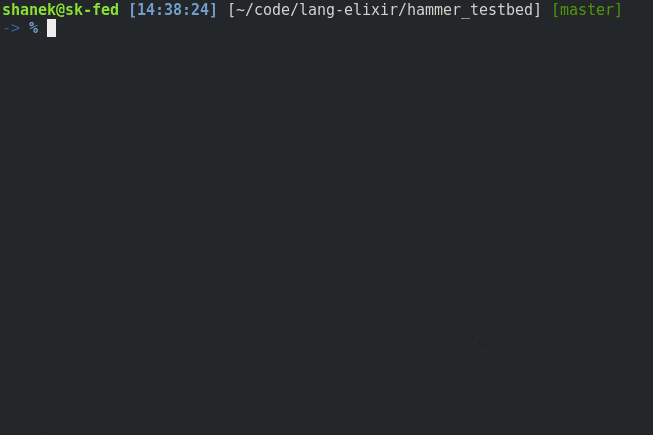

# HammerTestbed

A demo app for the [Hammer](https://github.com/ExHammer/hammer) rate-limiter.

To start your Phoenix server:

  * Install dependencies with `mix deps.get`
  * Install Node.js dependencies with `cd assets && npm install`
  * Start Phoenix endpoint with `mix phx.server`

Now you can visit [`localhost:4000`](http://localhost:4000) from your browser.

Ready to run in production? Please [check our deployment guides](http://www.phoenixframework.org/docs/deployment).

## Usage

Start the server, then visit `/timestamp`, to get the current time. This request will be denied if
the rate-limit is exceeded (5 requests in 60 seconds).

Hit `/timestamp/rl` to inspect the rate-limiter status.

Example:

```bash
curl http://localhost:4000/timestamp
# => {"timestamp":"2017-07-30 11:56:21.502347Z"}
```

See `config/config.exs` to see how Hammer and the backend are configured.

See `lib/hammer_testbed/web/controllers/page_controller` for an example of how to use
the Hammer rate-limiter.





## Testing

Run `./bin/test.sh`, observe the output.


## Learn more

  * Official website: http://www.phoenixframework.org/
  * Guides: http://phoenixframework.org/docs/overview
  * Docs: https://hexdocs.pm/phoenix
  * Mailing list: http://groups.google.com/group/phoenix-talk
  * Source: https://github.com/phoenixframework/phoenix
